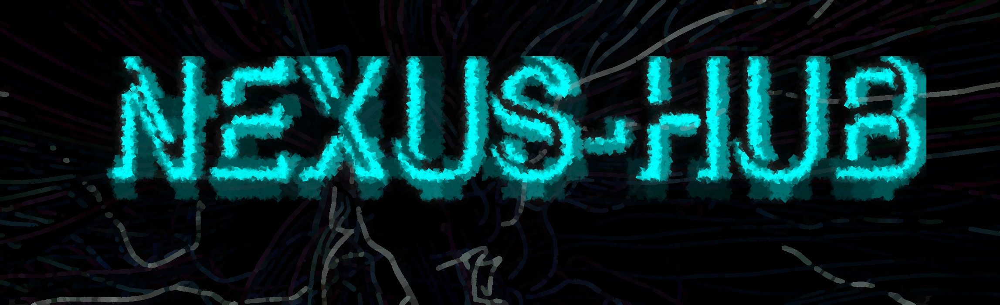

# NEXUS-HUB

**Un système décentralisé de curation**  
Archive de références vérifiables sur l'écologie, la conscience, les innovations biomédicales et la défense du vivant.

## 📖 Qu'est-ce que Nexus-Hub ?

Nexus-Hub est un système de curation rigoureux documentant les avancées dans cinq domaines interconnectés :
- 🌿 Écologie - Protection du vivant, énergies alternatives, communication végétale, plantes sacrées, astrophysique
- 🧠 Conscience - États modifiés, psychédéliques, méditation, rêves lucides, développement personnel
- 🥩 Viande Cultivée - Agriculture cellulaire, disruption de l'élevage industriel
- 🔬 Laboratoire & Biologie - Culture cellulaire, immunothérapie, édition génomique, lutte contre l'antibiorésistance
- ⚡ Biohacking - Neurofeedback, adaptogènes, nootropiques, optimisation physiologique

Chaque entrée renvoie à une source primaire vérifiable : publication peer-reviewed, rapport technique, innovation documentée. Pas d'extrapolation, pas de sensationnalisme, pas de bullshit.

---

## Critères de sélection

Une référence est archivée si elle répond à ces critères :
- Vérifiabilité - Source primaire accessible et traçable
- Rigueur - Méthodologie scientifique ou technique documentée
- Pertinence - Contribution significative au domaine concerné
- Honnêteté - Limites et biais explicitement mentionnés

---

## 🚀 Utilisation

**Consulter l'archive**  
bash# Cloner le repository  
git clone https://github.com/[ton-username]/nexus-hub.git  

**Explorer les catégories**  
cd nexus-hub  
ls -R

**Créer un miroir et contribution**  
bash# Fork le repo sur GitHub  
git pull origin main  # Synchroniser régulièrement  

**Fork le repository**  
Ajoute ta référence dans la catégorie appropriée (format .nfo)  
Vérifie que la source est accessible et vérifiable  
Soumets une Pull Request avec description claire  

Important : Seules les sources vérifiables et rigoureuses sont acceptées. Pas de pseudo-science, pas de clickbait, pas de contenu non sourcé.

---

## 📜 Manifeste

**Indépendance structurelle**  
Ce repository n'est lié à aucune plateforme commerciale. Il existe sur GitHub mais peut être mirroré ailleurs (GitLab, Codeberg, serveur personnel). L'objectif est la pérennité et l'accessibilité du savoir.

**Vérifiabilité systématique**  
Chaque entrée renvoie à une source primaire. La vérifiabilité n'est pas une garantie de vérité absolue — la science progresse par réfutation — mais c'est la seule barrière viable contre la désinformation.

**Refus de la marchandisation**  
Pas de monétisation, pas de tracking, pas de compromis avec des logiques publicitaires. L'archive existe, point. Si elle est utile, elle sera trouvée.

**Défense du vivant comme horizon**  
Toutes les catégories convergent vers une même préoccupation : préserver et étendre le vivant, sous toutes ses formes. Nous sommes à un point de bifurcation. Soit nous développons les technologies et pratiques permettant de coexister durablement avec les autres formes de vie, soit nous accélérons l'effondrement.
Nexus ne sauvera rien ni personne. Mais il peut contribuer à diffuser les connaissances qui rendent possibles d'autres choix.

---

## 🛡️ Éthique & Limites

**Ce que Nexus n'est pas**  
Pas une plateforme de débat – C'est une archive de sources, pas un forum  
Pas exhaustif - Réflexion de mes centres d'intérêt personnels  
Pas neutre - La curation implique toujours des choix subjectifs  
Pas un substitut médical - Aucune référence ne remplace un avis médical professionnel  

**Intolérance au relativisme éthique**  
Ce repository n'hébergera jamais de contenu raciste, antisémite, homophobe, transphobe, sexiste ou validiste. Défendre le vivant implique de refuser tout ce qui déshumanise.

---

## 🔗 Liens

Site de Nexus-Hub : https://nexus-hub.nekoweb.org  
Social de l'auteur : https://rogn.io/NDq2V3  
Site personnel : https://connexions-vivant.ovh

---

## 📄 Licence

Ce travail est sous licence Creative Commons Attribution-ShareAlike 4.0 International.  
Tu es libre de :
- Partager - copier et redistribuer le contenu
- Adapter - remixer, transformer et créer à partir du contenu

Selon les conditions suivantes :
- Attribution - Tu dois créditer l'œuvre et indiquer les modifications
- Partage dans les mêmes conditions - Si tu transformes le contenu, tu dois distribuer ta contribution sous la même licence

---

## 🙏 Remerciements

À tous ceux qui produisent, partagent et préservent le savoir accessible.  
À ceux qui refusent la banalisation de la haine et la marchandisation de l'information.  
À ceux qui défendent le vivant.

> *Nexus-Hub – Documenter plutôt que commenter. Sourcer plutôt que spéculer.*
